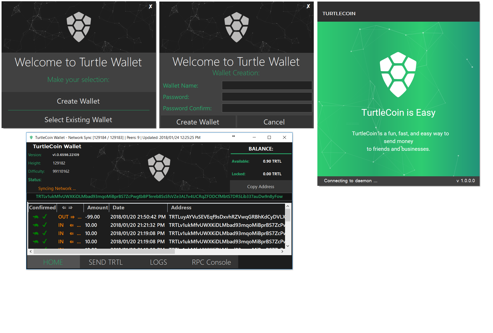

# TurtleCoin Wallet .NET

TurtleCoin Wallet written in C# for windows and linux through Mono.

# Download and Running

Check here for the latest release: 
https://github.com/codingwithredbull/TurtleCoin-Wallet-.NET/releases

After downloading extract and run the TurtleWallet.exe

# In progress

The wallet is stable enough to run the release fine, however development is in progress. You may download the release archive or compile yourself

# future

This repo will later be switched from winforms and C# to Xamarin to run cross-platform on more devices.